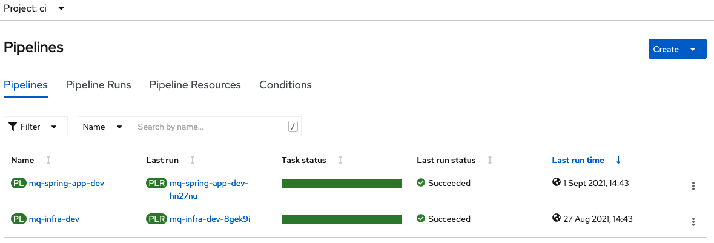
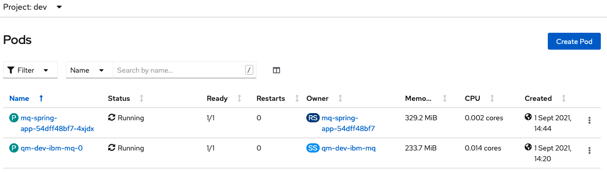
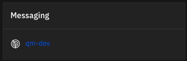
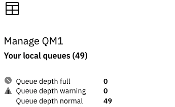
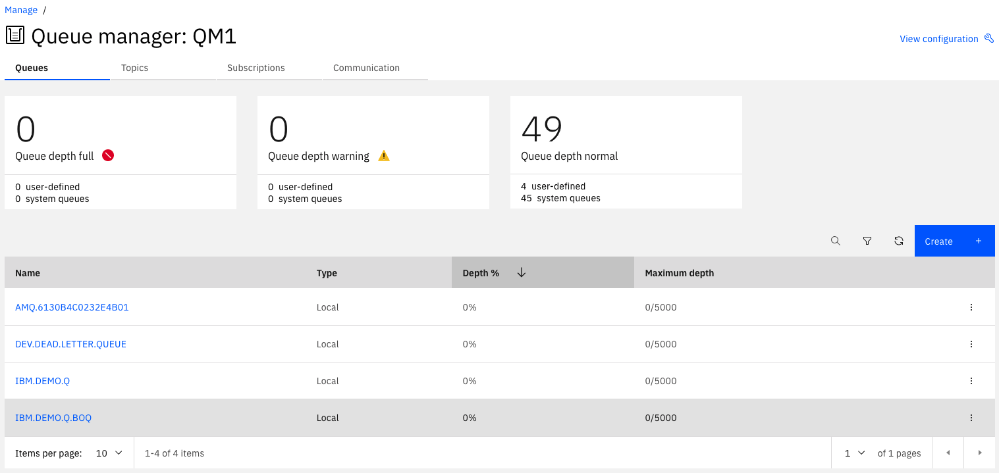
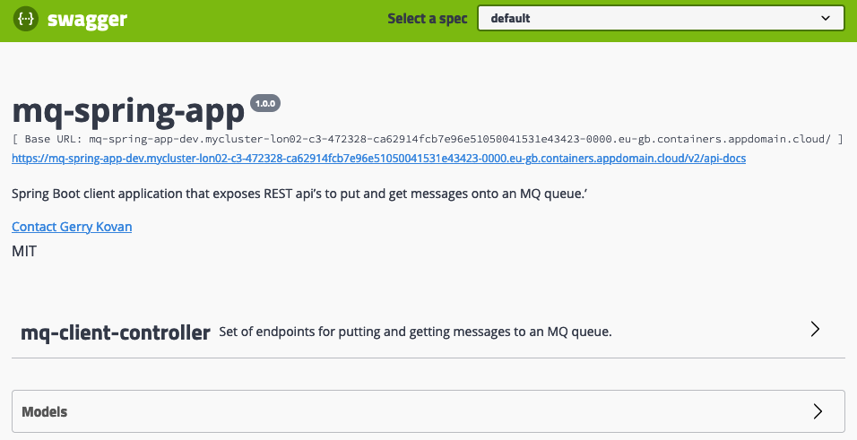

# Cloud Native Toolkit Deployment Guides

This Git repository is to demo the ability to deploy IBM Cloud Paks using a GitOps workflow.

This specific repository focuses on deploying IBM MQ from the IBM Cloud Pak for Integration. Red Hat OpenShift Pipelines (Tekton), Red Hat OpenShift GitOps (ArgoCD) and Kustomize manage the GitOps workflow.


### Prerequisites
- An OpenShift cluster (version 4.7+)
- Install the [Github CLI](https://github.com/cli/cli) (version 1.14.0+)
- Install the OpenShift CLI `oc` (version 4.7 or 4.8)
- Install the [kubeseal CLI](https://github.com/bitnami-labs/sealed-secrets#homebrew)
- Create a new [GitHub Organization](https://docs.github.com/en/organizations/collaborating-with-groups-in-organizations/creating-a-new-organization-from-scratch) to use for this demo.
- Generate a [GitHub Personal Access Token (PAT)] for the new organisation (https://docs.github.com/en/github/authenticating-to-github/keeping-your-account-and-data-secure/creating-a-personal-access-token) with the following scopes
    - [ ] repo
        - [x] public_repo
    - [ ] admin:repo_hook
        - [x] write:repo_hook
    <details>
    <summary> View screen capture of scopes required </summary>

    

    </details>


### Deploy the IBM MQ operator and its pre-requisites
- Log in with the Github CLI
    ```bash
    gh auth login
    ```

- Setup a local Git directory to clone all the Git repositories
    ```bash
    mkdir -p mq-production
    ```

- Download [sealed-secrets-ibm-demo-key.yaml](https://bit.ly/demo-sealed-master) and save in the default location `~/Downloads/sealed-secrets-ibm-demo-key.yaml`. You can override the location when running the script with `SEALED_SECRET_KEY_FILE`.

**Do not check this file in to Git as it contains a private key!**.

- Log into your OCP cluster, substituting the `--token` and `--server`
  parameters with your values:

  ```bash
  oc login --token=<token> --server=<server>
  ```

  If you are unsure of these values, click your user ID in the OpenShift web console and select `Copy login command`.

- Run the bootstrap script, specifying the new Git org you created above `GIT_ORG` and the new output directory to clone all repos to `OUTPUT_DIR`. You can use `DEBUG=true` for verbose output.
  **Note, the deployment of all selected resources will take 30 - 45 minutes**.
  ```bash
  curl -sfL https://raw.githubusercontent.com/cloud-native-toolkit-demos/multi-tenancy-gitops-mq/ocp47-2021-2/scripts/bootstrap.sh | DEBUG=true GIT_ORG=<YOUR_GIT_ORG> OUTPUT_DIR=mq-production bash
  ```

- Open the ArgoCD UI from the OpenShift Console (the URL is also printed by the previous command), then use `admin` as the username and password which also was printed by the previous command

- You can open the output directory with VSCode and view the set of required Git repositoies that have been forked into your GitHub Organization.
    ```bash
    code mq-production
    ```

- At this point, you can already demonstrate the value of using a GitOps approach (OpenShift Pipelines) to declaratively deploy the IBM MQ operator and its dependencies.


### Execute pipelines to deploy a Queue Manager and Spring application to write messages to the queue.
- Before running the pipelines, verify the Platform Navigator and Common Services instances have been deployed successfully.
    ```bash
    oc get commonservice common-service -n ibm-common-services -o=jsonpath='{.status.phase}'
    ```
    Expected output = Succeeded

    ```bash
    oc get platformnavigator -n tools -o=jsonpath='{ .items[*].status.conditions[].status }'
    ```
    Expected output = True

- You can also check all operators are installed correctly in the OpenShift Console by going to `installed Operators` selecting `All Projects` and checking all operators are in the `succeeded` state.

- Configure the cluster with your GitHub Personal Access Token (PAT), update the `gitops-repo` Configmap which will be used by the pipeline to populate the forked GitOps repository and add the `artifactory-access` Secret to the `ci` namespace.  Specify values for the `GIT_USER`, `GIT_TOKEN` and `GIT_ORG` environment variables.
    ```bash
    cd mq-production/gitops-3-apps/scripts

    curl -sfL https://raw.githubusercontent.com/cloud-native-toolkit-demos/multi-tenancy-gitops-apps/ocp47-2021-2/scripts/mq-kubeseal.sh | DEBUG=true GIT_USER=<GIT_USER> GIT_TOKEN=<GIT_TOKEN> GIT_ORG=<GIT_ORG> bash
    ```

    As this script executes it will issue a `git diff` to allow you to review
    its customizations.
    - Type `q` when you're finished examining the changes; the script will continue to completion.

- Complete bootstrap of the application layer. So far ArgoCD has setup our cluster and installed all the operators and instances we require in the `ci` namespace. When you reviewed the repository in a previous step you may have noticed there are 3 essential layers to the setup: `Infra`, `Services` and `Apps`. The first two layers are complete, and part of the 3rd layer (`Apps`) is also complete. We now need to complete the `Apps` layer before running the pipelines as this will create the instances of the queue managers.
    - From the home directory `mq-production` root directory change to the following directory:
      ```bash
      cd mq-production/gitops-0-bootstrap-mq/0-bootstrap/argocd/single-cluster/3-apps
      ```
    - In this directory you will find the file `kustomization.yaml`. ArgoCD reads this file which directs it to subdirectories to read for further Kustomize files. By default you will see that only `- argocd/mq/cicd.yaml` is currenty configured. We also need to add the `dev`, `stage` and `prod` subdirectories.
    - Edit `kustomization.yaml` and uncomment the following files:
    ```bash
    - argocd/mq/dev.yaml
    - argocd/mq/stage.yaml
    - argocd/mq/prod.yaml
    ```
    - Save the changes.
    - Next we need to commit these to our Git repository that ArgoCD is watching:
    ```bash
    git add .
    git commit -s -m "Add dev stage and prod mq apps to the cluster"
    git push origin
    ```
    - Finally we need to wait for ArgoCD to synchronise these changes. If you like you can go back to the ArgoCD console and manually synchronise all the apps by clicking the `SYNC APPS` button in the top left of the console and selecting `ALL` apps before clicking `SYNC`.
    - After synchronisation is complete, you will see some applications in ArgoCD have the status `Unknown`. This is to be expected at this stage and is resolved as we start to run the pipelines.

- Run a pipeline to build and deploy a queue manager to the `dev` namespace
    - Log in to the OpenShift Web Console.
    - Select `Pipelines > Pipelines` view in the `ci` namespace.
    - Click the `mq-infra-dev` pipeline and select Actions > Start.
    - Provide the HTTPS URL for the `mq-infra` repository in your Git Organization.
    - Click Start

    **Note, the pipeline will take several minutes to complete as it builds and tests the queue manager ready for deployment**

    

- Run a pipeline to build and deploy a Spring application to the `dev` namespace
    - Log in to the OpenShift Web Console.
    - Select `Pipelines > Pipelines` view in the `ci` namespace.
    - Click the `mq-spring-app-dev` pipeline and select Actions > Start.
    - Provide the HTTPS URL for the `mq-spring-app` repository in your Git Organization.
    - Click Start.

    

- The pipelines will take a few minutes to complete all tasks. Once complete you should see both pipelines have a status of `succeeded`.


- Both the queue manager and spring application instances are running in the `dev` namespace. You can review both of these by viewing `pods` in the `dev` namespace.


- The Platform Navigator console has been installed as part of the IBM Cloud Pak for Integration. We use the Platform Navigator to view our queue manager and its queues. The Spring application includes a Swagger interface which we can use to call methods on the Spring application. In the next few steps we will use these to interact with both the queue manager and Spring application.

- The Platform Navigator instance runs in the `tools` namespace.
    - Run the following `oc` command to display the URL for the Platform Navigator console:
    ```bash
    oc get route integration-navigator-pn -n tools
    ```
    - Copy the URL from the `HOST/PORT` column and paste into a browser, prefixed with `https://`.
    - Next find the secret for the Platform Navigator that contains the logon password. The secret resides in the `dev` namespace:
    ```bash
    oc get secret ibm-iam-bindinfo-platform-auth-idp-credentials -n dev -o yaml
    ```
    - The password is base64 encoded. This needs to be decoded, for example:
    ```bash
    echo "<value of admin_password>" | base64 -d
    ```
    - Enter 'admin` for the Username field and the output from the base64 commmand for the Password field.
    - You have now successfully logged into the Platform Navigator console.
    - You can view the queue manager created by the GitOps process.
    - Select the `Messaging` tile in the middle of the homepage to take us to the messaging view:
    
    - Select our queue manager `QM1` by selecting this tile:

    
    - Details of the queues can now been seen for our queue manager. Selecting a queue will display further details where you can view the content of messages on the queue.
    

- The Spring application runs in the `dev` namespace.
    - Run the following `oc` command to display the URL for the Spring application Swagger interface:
    ```bash
    oc get route mq-spring-app -n dev
    ```
    - Copy the URL from the `HOST/PORT` column and paste into a browser, prefixed with `https://`.
    
    - Click on `mq-client-controller` where you will see the following 3 endpoints:
        - GET /api/recv
        - GET /api/send-hello-world
        - POST /api/send-json
    - Click `POST /api/send-hello-world` followed by `Try it out` followed by `Execute`. This will call the Spring application which in turn will put a `Hello World!` message on the queue `IBM.DEMO.Q` of queue manager `QM1`.
    - From the Platform Navigator console, select this queue followed by the message to display the message details.
    - Now click `POST /api/recv` followed by `Try it out` followed by `Execute`. This will call the Spring application which in turn will get the `Hello World!` message from the queue.
    - From the Platform Navigator console, refresh this queue to see the message was got by the Spring application.

- **Congratulation!** You have now successfully installed IBM MQ as part of the IBM Cloud Pak for Integration, and a Spring application using a fully automated GitOps process. You have also been able to view the queue manager using the Platform Navigator console and call methods on the Spring application.

### References
- This repository shows the reference architecture for GitOps directory structure for more info https://cloudnativetoolkit.dev/learning/gitops-int/gitops-with-cloud-native-toolkit

