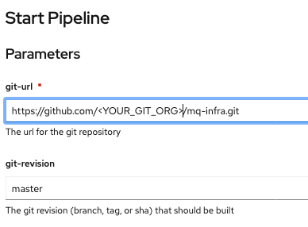
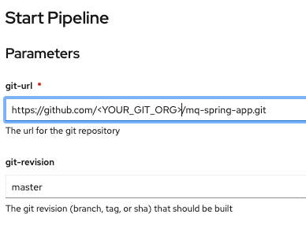

# Cloud Native Toolkit Deployment Guides

This git repository is to demo the ability to deploy IBM Cloud Paks using a GitOps workflow.

This specific repository focuses on on deploying IBM MQ.


### Prerequisites
- Install the [Github CLI](https://github.com/cli/cli)
- Install the OpenShift CLI `oc` (version 4.7 or 4.8)
- Create a new [GitHub Organization](https://docs.github.com/en/organizations/collaborating-with-groups-in-organizations/creating-a-new-organization-from-scratch) to use for the demo.
- Generate a [GitHub Personal Access Token (PAT)](https://docs.github.com/en/github/authenticating-to-github/keeping-your-account-and-data-secure/creating-a-personal-access-token) with the following scopes
    - [ ] repo
        - [x] public_repo
    - [ ] admin:repo_hook
        - [x] write:repo_hook
    <details>
    <summary> View screen capture of scopes required </summary>

    

    </details>


### Deploy the IBM MQ operator and its pre-requisites
- Log in with the Github CLI 
    ```bash
    gh auth login
    ```

- Setup a local git directory to clone all the git repositories
    ```bash
    mkdir -p mq-production
    ```

- Download [sealed-secrets-ibm-demo-key.yaml](https://bit.ly/demo-sealed-master) and save in the default location `~/Downloads/sealed-secrets-ibm-demo-key.yaml`. You can override the location when running the script with `SEALED_SECRET_KEY_FILE`. Remember do not check this file to git.

- Run the bootstrap script, specify the git org `GIT_ORG` and the output directory to clone all repos `OUTPUT_DIR`. You can use `DEBUG=true` for verbose output
    ```bash
    curl -sfL https://raw.githubusercontent.com/cloud-native-toolkit-demos/multi-tenancy-gitops-mq/ocp47-2021-2/scripts/bootstrap.sh | DEBUG=true GIT_ORG=<YOUR_GIT_ORG> OUTPUT_DIR=mq-production bash
    ```

- Open the ArgoCD UI from the OpenShift Console, then use `admin` as the username and password should have printed in the previous command

- You can open the output directory with VSCode and the set of required git repositoies has been forked into your GitHub Organization. 
    ```bash
    code mq-production
    ```

- At this point, you can already demonstrate the value of using a GitOps approach (OpenShift Pipelines) to declaratively deploy the IBM MQ operator and its dependencies.  


### Execute pipelines to deploy a Queue Manager and Spring application to write messages to the queue.
- Configure the cluster with your GitHub Personal Access Token (PAT), update the `gitops-repo` Configmap which will be used by the pipeline to populate the forked gitops repository and add the `artifactory-access` Secret to the `ci` namespace.  Specify values for the `GIT_USER`, `GIT_TOKEN` and `GIT_ORG` environment variables.
    ```bash
    cd mq-production/gitops-3-apps/scripts

    curl -sfL https://raw.githubusercontent.com/cloud-native-toolkit-demos/multi-tenancy-gitops-apps/ocp47-2021-2/scripts/mq-kubeseal.sh | DEBUG=true GIT_USER=<GIT_USER> GIT_TOKEN=<GIT_TOKEN> GIT_ORG=<GIT_ORG> bash
    ```

- Run a pipeline to build and deploy a Queue Manager
    - Log in to the OpenShift Web Console.
    - Select Pipelines > Pipelines view in the `ci` namespace. 
    - Click the `mq-infra-dev` pipeline and select Actions > Start.
    - Provide the HTTPS URL for the `mq-infra` repository in your Git Organization.
    

- Run a pipeline to build and deploy a Spring application
    - Log in to the OpenShift Web Console.
    - Select Pipelines > Pipelines view in the `ci` namespace. 
    - Click the `mq-spring-app-dev` pipeline and select Actions > Start.
    - Provide the HTTPS URL for the `mq-spring-app` repository in your Git Organization.
    

### References
- This repository shows the reference architecture for gitops directory structure for more info https://cloudnativetoolkit.dev/learning/gitops-int/gitops-with-cloud-native-toolkit

